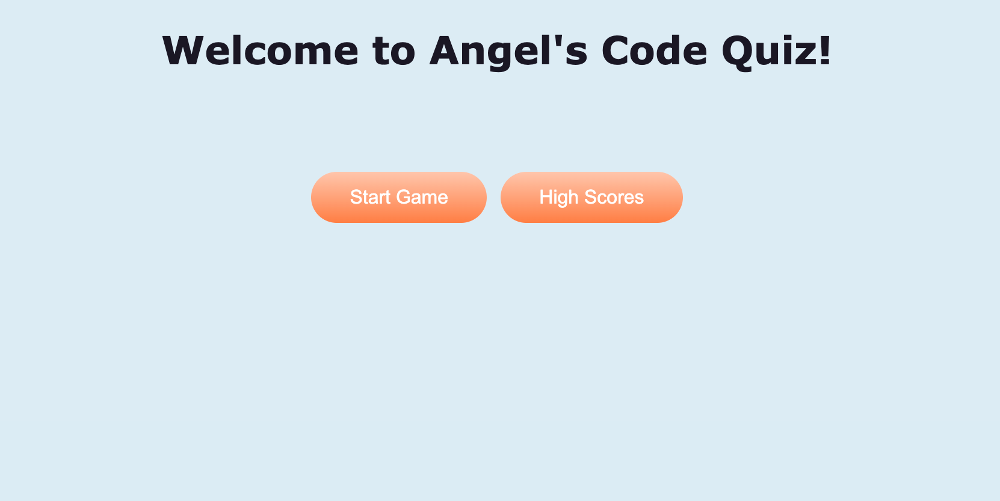
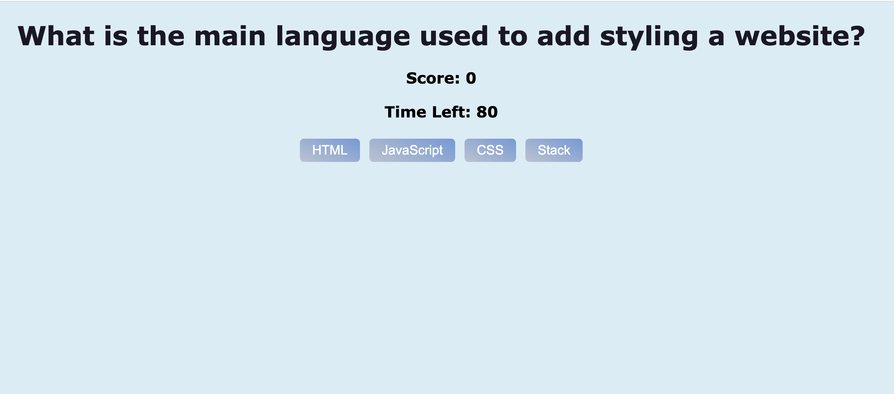
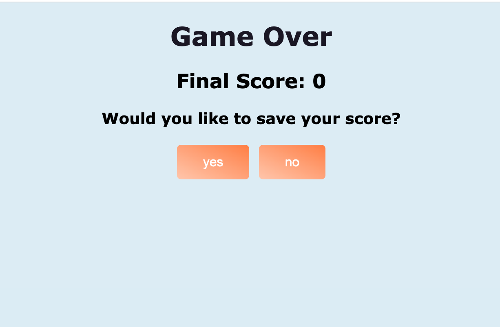
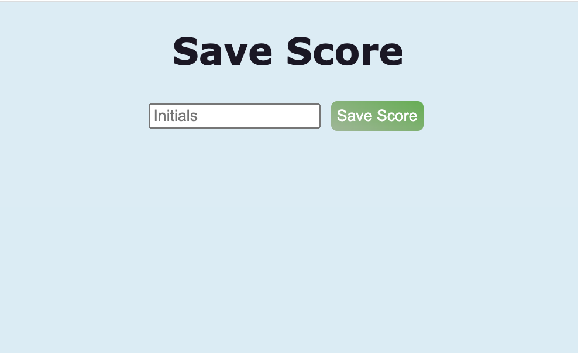

# Code Quiz

## Description

Practice and study allows students to improve their understanding of the material that they are learning. One of the best ways for a student to confirm their understanding is to test their knowledge on the material. This website was designed to help students who are learning web developement. By answering the questions in this test, students can test and solidify their knowledge on HTML, CSS, Javascript, or any else related to web developement. They can also compare their level of knowledge to other students who have use this website through the leaderboard.

For me, another benefit of creating this website was to apply the knowledge that I learned during the 4th module of my coding bootcamp. I learned to incorporate DOM elements, use local storage, set timers, and so much more! I am thankful that I was able to practice these new skills and have a website to reference whenever I want to refresh my knowledge of web developement. Additionally, I got a lot better at pseudocoding during module 4 of my bootcamp, so I added a lot of pseudocode to this project. This helped immensely while writing my JavaScript code.

## Table of Contents

- [Installation](#installation)
- [Usage](#usage)
- [Code](#code)
- [Credits](#credits)
- [License](#license)
- [Badges](#badges)

## Installation

1. Click on green code button and copy the ssh link
2. Open up terminal or git bash, then navigate to where you want the repository to be placed.
3. Type out "git clone (ssh link)"

## Usage


The best way to use this website is as a quiz to test your own web dev knowledge. The easiest way to use it is by opening the website using 'Visual Studio Code'. To do this, right click on the index.html file and click on "Open in Default Browser." You can also open it using [my website](https://angellyn218.github.io/code-quiz/).

When the website opens up, you should see the following screen:



The first button, which is labeled 'Start Game', will start the quiz for you. Once started, you will get prompted by a series of questions in a screen similar to the one seen below:



If answered correctly, 1 point is added to your score. If answered incorrectly, 15 seconds is subtracted from your time left. The bottom of the screen will display 'Correct!' if you chose the right answer and 'Wrong...' otherwise.

Once all the questions have been answered or once the timer runs out, the 'Game Over' screen will be displayed.



The 'no' button takes you back to the welcome screen. The yes 'button' takes you to the following 'Save Score' screen.



Within the input box, you can type in your initials, then press submit which returns you to the welcome screen. You score is saved to the local storage and the Leaderboard. If you don't add initials, you will be stopped from continuing to the welcome screen with the message 'No initials. Please try again.' If you add more than 4 initials, you will be stopped from continuing to the welcome screen with the message 'Initials too long. Please try again.'

The Leaderboard can be accessed by clicking the other button on the welcome screen which is labeled 'High Scores'.


The first button takes the user back to the 'Welcome screen'. The second button, which is labeled 'Delete Leaderboard', deletes the leaderboard after confirming with the user. 

## Code

During this project, I created a lot of different functions to help me make my website efficient and smooth. One code snippet that I am proud of is the following code:

```
var screensEls = document.getElementsByClassName("screens");

function makeVisible(screen) {
    for (var i = 0; i < screensEls.length; i++) {
        var id = screensEls[i].getAttribute("id");
        if (id === screen) {
            screensEls[i].setAttribute("style", "display:inline");
        } else {
            screensEls[i].setAttribute("style", "display:none");
        }
    }
}
```

This function's purpose is to make only one div section visible at a time. It takes in an input sting which should match the id of one div sections on the website. Next, it iterates through each DOM with the class of 'screen'. If the screen id matches, then it sets the screen's display to inline. Otherwise, it sets the display to none. This function not only makes the desired screen visible, it also makes sure that all other screens are not visible.

Since all screens are stored in the index.html file, I had to make sure that only one screen was visible at a time. I used this function in nearly all of my other JavaScript functions. While not completely necessary, it added an extra level of assurance. 

In addition to its usefulness in my code, this function taught me to apply the skills of setting attributes and accessing the DOM which was new content that I learned during module 4 of my coding bootcamp.

## Credits

getElementByClassName: https://www.w3schools.com/jsref/met_document_getelementsbyclassname.asp

Array .sort function: https://developer.mozilla.org/en-US/docs/Web/JavaScript/Reference/Global_Objects/Array/sort

clearInterval: https://www.w3schools.com/jsref/met_win_clearinterval.asp 

color palette generator: https://coolors.co/1b1725-6ea4bf-87b37a-f7a072-9ba7c0

hex code color: https://www.w3schools.com/css/css_colors_hex.asp

removeChild: https://developer.mozilla.org/en-US/docs/Web/API/Node/removeChild


## License

Please refer to LICENSE in this repository.


## Badges


